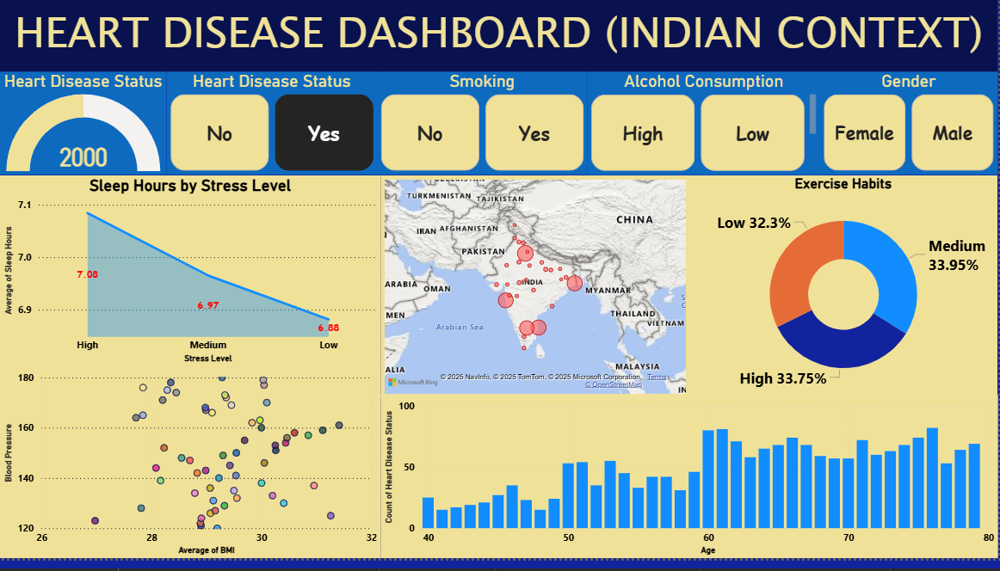

# 💓 Heart Disease Dashboard (Indian Context) 💓

---

## 🚀 Project Overview

Welcome to this dynamic **Power BI dashboard** crafted to analyze heart disease trends in India! This project, developed during my MBA mid-term, harnesses interactive visualizations and insightful analytics to explore critical health and lifestyle factors contributing to heart disease. Dive into data-driven storytelling that paints a picture of heart health across demographics and regions.

---

## 📊 Data Description & Source

- The data originates from a well-known Kaggle dataset and is enhanced with **hypothetical features** such as Date of Diagnosis, Work Type, and City to enrich the analysis.
- **⚠️ Note:** This is **secondary data** which is **not verified**, so insights should be treated as illustrative rather than conclusive.

---

## 🎯 Objectives

- Analyze key drivers such as **age, BMI, exercise habits, smoking, alcohol use, sleep patterns,** and **stress** in relation to heart disease.
- Visualize *geographical variations* and temporal trends across diverse populations.
- Showcase advanced Power BI capabilities in **data modeling, relational insights, and captivating visual storytelling**.

---

## ✨ Dashboard Highlights

- 🔍 **Interactive Filters:** Drill down by Disease Status, Smoking, Drinking Habits, and Gender for tailored insights.
- 🗺️ **Heatmap:** Pinpoint disease prevalence across Indian cities.
- 💤 **Stress & Sleep:** Track how stress levels impact average sleep hours.
- 🏃‍♂️ **Exercise Habits:** Visual pie chart depiction of low, medium, and high activity groups.
- 📈 **BMI & Blood Pressure:** Scatterplot reveals lifestyle correlations.
- 📊 **Age Breakdown:** Distribution of disease cases across age demographics.
- 🎯 **Real-Time KPIs:** Snapshot gauges for crucial indicators.

---

## 🔍 Key Insights

- ⚠️ Heart disease risk markedly **increases after age 40**, with a sharp rise post-60.
- 📊 High **BMI and hypertension** are strongly linked to heart disease and related conditions.
- 🏋️‍♀️ **Low exercise frequency** correlates with elevated disease prevalence.
- 🚭 Smoking and excessive drinking amplify risk synergistically.
- 😰 High stress and poor sleep (< 6 hours) associate with worse heart health markers.
- 🏙️ Metro cities exhibit **higher disease rates**, reflecting lifestyle and environment factors.

---

## ⚠️ Limitations

- The dataset contains **fewer positive heart disease cases** than negatives, limiting the statistical strength to uncover significant drivers.
- More extensive, verified data with greater positive case volume would improve findings and real-world applicability.
- Some features are hypothetical to supplement the dataset and may not represent true values.

---

## 🚀 Getting Started

1. Download the **Power BI report file (.pbix)** and view the dashboard snapshot.
2. Open in Power BI Desktop or Power BI Service.
3. Use interactive filters to explore and uncover insights on heart disease patterns across India.

---

## 🤝 Connect with Me

Questions, feedback, or collaboration inquiries? Feel free to open an issue or connect with me on **[LinkedIn]([https://www.linkedin.com/in/adhikarykrishnendu/])**.

---

> *This dashboard is for academic and demonstration purposes. Please interpret findings cautiously because of data limitations and absence of formal verification.*

